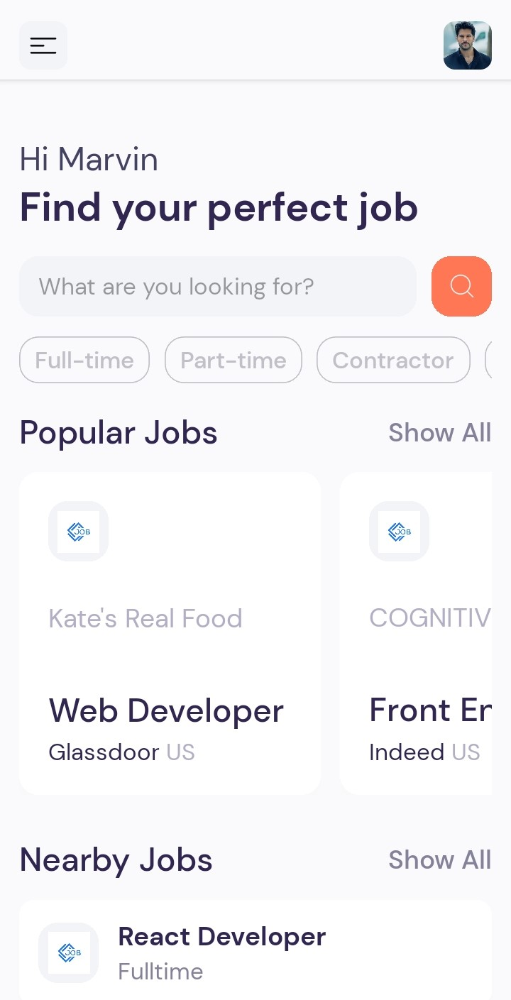
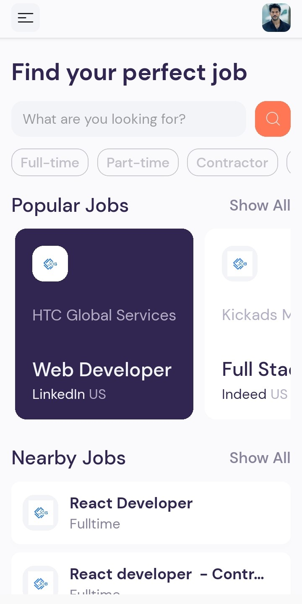
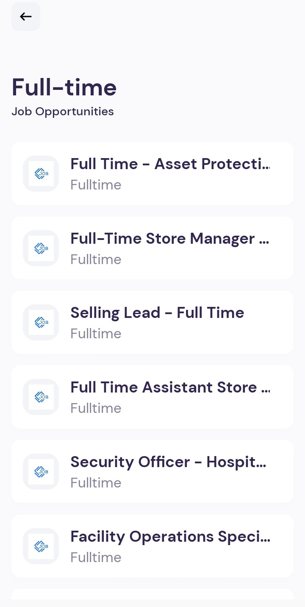
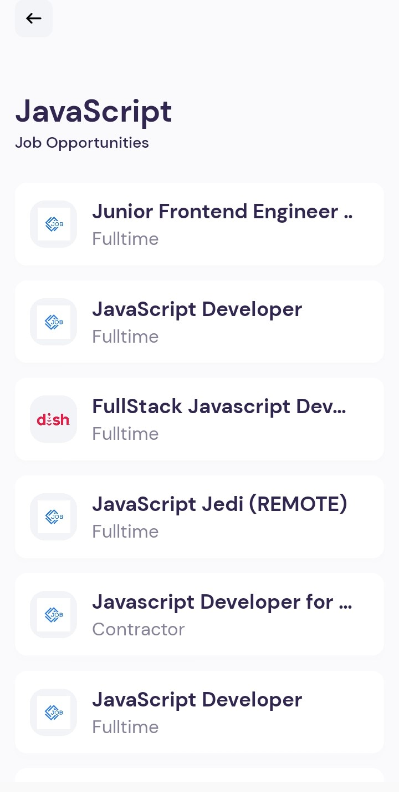

# Jobit

Jobit is a React Native app built with Expo for job search. It initially loads Web Developer and React jobs and allows users to search for jobs by keyword (e.g., "Project management jobs") or job type (e.g., Full-time, Part-time, contractor). The app displays the job listings using a FlatList and navigates through pages using Expo Router.

## Table of Contents

- [Features](#features)
- [Getting Started](#getting-started)
  - [Prerequisites](#prerequisites)
  - [Installation](#installation)
  - [Running the App](#running-the-app)
- [Usage](#usage)
- [Data Source](#data-source)
- [Screenshots](#screenshots)
- [Contributing](#contributing)
- [License](#license)
- [Acknowledgements](#acknowledgements)

## Features

- **Initial Job Listings**: Loads Web Developer and React jobs by default.
- **Search Functionality**: Search for jobs using keywords or job types.
- **Job Listings**: Display job listings using a FlatList.
- **Navigation**: Navigate between pages using Expo Router.

## Getting Started

Follow these instructions to get a copy of the project up and running on your local machine.

### Prerequisites

- Node.js
- Expo CLI

### Installation

1. Clone the repository:
   ```bash
   git clone https://github.com/marvin-nyalik/jobit.git
   ```
2. Navigate to the project directory:
   ```bash
   cd jobit
   ```
3. Install the dependencies:
   ```bash
   npm install
   ```

### Running the App

1. Start the development server:
   ```bash
   npx expo start
   ```
2. Open the Expo Go app on your mobile device and scan the QR code generated by the development server.

## Usage

1. **Initial Job Listings**: The app loads Web Developer and React jobs by default.
2. **Search**: Use the search bar to enter a keyword (e.g., "Project management jobs") or select a job type (e.g., Full-time, Part-time, contractor) to filter job listings.
3. **Navigation**: Use the navigation options to move between different pages of the app.

## Data Source

Jobit uses the JSearch API from RapidAPI to fetch job data.

## Screenshots

<div style="display: flex; flex-wrap: wrap; justify-content: space-between;">
  
  
  
  
  
  
  
  
</div>

## Contributing

Contributions are welcome! Please open an issue or submit a pull request for any improvements or bug fixes.

## License

This project is licensed under the MIT License - see the [LICENSE](LICENSE) file for details.

## Acknowledgements

- [Expo](https://expo.io/)
- [React Native](https://reactnative.dev/)
- [RapidAPI](https://rapidapi.com/)
